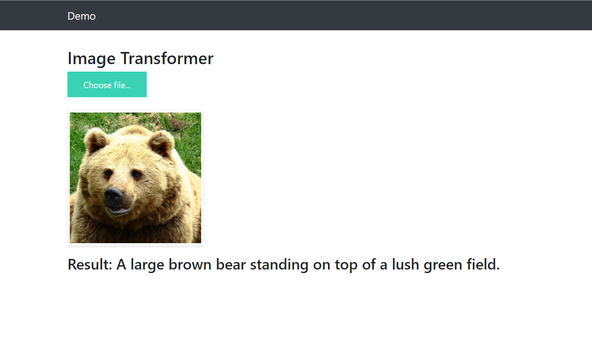
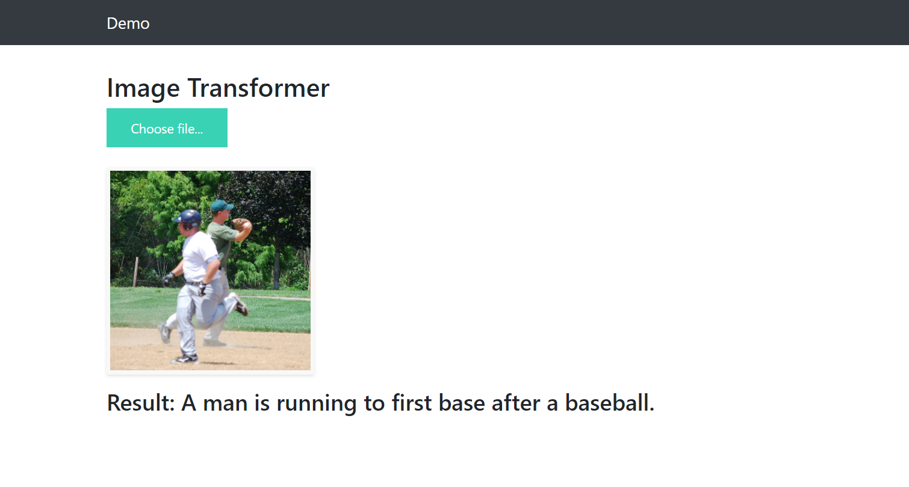

# Image-Captioning-Demo

### Samples:

<p align="center">
  
  
</p>

All these images has been annotated by image transformer.

# Usage 
First, clone the repository locally:
```
$ git clone https://github.com/saahiluppal/catr.git
```
Then, install dependencies:
```
$ pip install -r requirements.txt
```
Afterwards, download the checkpoints.zip and unzip it to the working directory
```
$ unzip chekpoints.zip
```
Finally, run the app.py
```
$ python app.py
```
